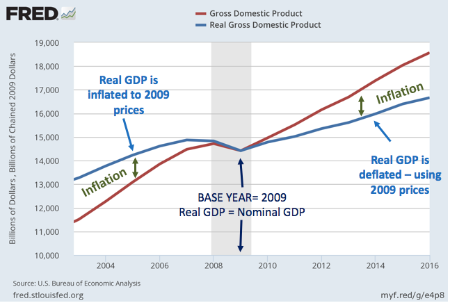
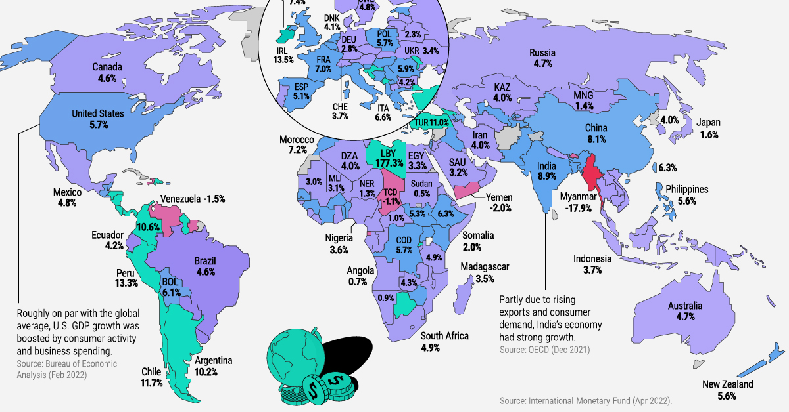
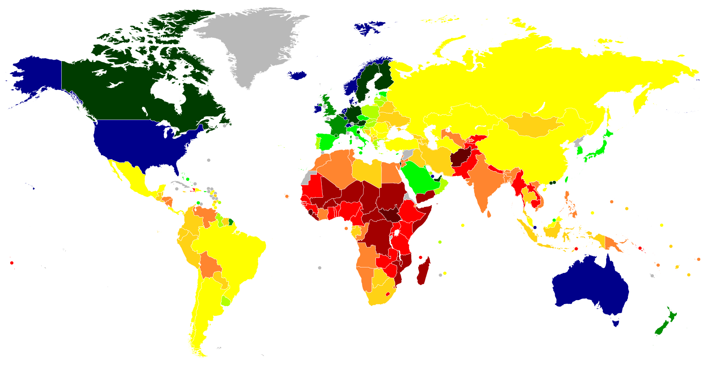

# GDP

#### What is GDP?

**Gross Domestic Product (GDP)** is the total monetary value of all final goods and services produced within a country's borders over a specific period of time (usually a quarter or a year). It serves as the primary indicator of a country's economic size, health, and growth.

GDP only includes **final goods and services** to avoid double-counting (e.g., the value of steel is included in the car it's used to build, not counted separately). It measures production within the geographic borders, regardless of who owns the companies (unlike Gross National Product, which focuses on ownership/nationality).

#### How is GDP Calculated?

The most common method is the **expenditure approach**:

**GDP = C + I + G + (X - M)**

* **C (Consumption)**: Spending by households on goods and services (e.g., food, cars, healthcare). This is usually the largest component, often 60-70% in developed economies like the US.
* **I (Investment)**: Business spending on capital (e.g., machinery, factories) plus residential construction and changes in inventories.
* **G (Government Spending)**: Government purchases of goods and services (e.g., infrastructure, defense). Does not include transfer payments like welfare.
* **X - M (Net Exports)**: Exports minus imports. A trade surplus boosts GDP; a deficit reduces it.

Here's a visual representation of typical GDP components (using US data as an example, where consumption dominates):

<figure><figcaption></figcaption></figure>

Other approaches (which should yield the same result):

* **Income approach**: Sum of all incomes earned (wages, profits, rents, etc.) plus taxes and depreciation.
* **Production (value-added) approach**: Sum of value added at each stage of production across industries.

#### Types of GDP

* **Nominal GDP**: Measured at current market prices, including inflation.
* **Real GDP**: Adjusted for inflation (using a base year), to show actual growth in output.

The difference highlights how inflation can make nominal GDP rise even if production doesn't. Here's a graph illustrating nominal vs. real GDP over time:

<figure><figcaption></figcaption></figure>

<figure><figcaption></figcaption></figure>

Other variants:

* **GDP per capita**: GDP divided by population, better for comparing living standards.
* **PPP-adjusted GDP**: Accounts for purchasing power differences across countries.

#### Why Does GDP Matter?

GDP tracks economic growth (positive = expansion; two consecutive negative quarters often signals recession). It's used for policy decisions, comparing economies, and assessing productivity. However, it has limitations: it doesn't measure inequality, environmental damage, unpaid work, or well-being.

#### Current Global Context (as of early 2026)

Global GDP growth is projected around 3.2-3.3% for 2025-2026, below pre-pandemic averages, due to trade tensions and policy uncertainty. The largest economies remain the US, China, Germany, and India (with India potentially surpassing Japan soon).

For a view of global economic distribution by country:

<figure><figcaption></figcaption></figure>

<figure><figcaption></figcaption></figure>

